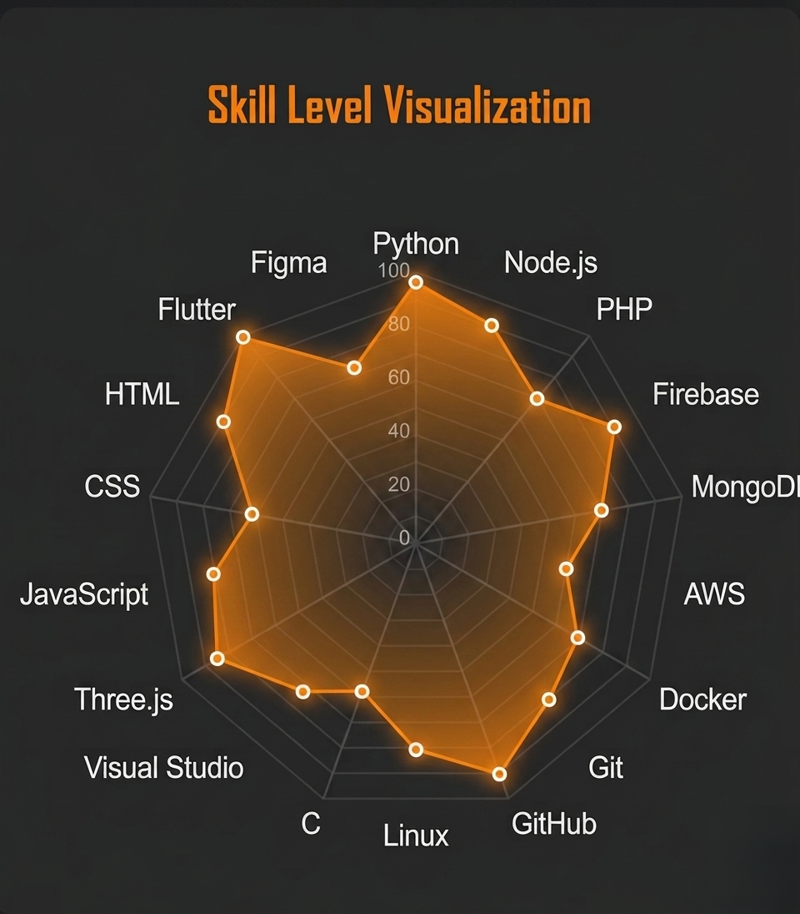

    

# <h1 align="center">Hi 👋, I'm JAYMEEN VAGHELA</h1>
###

<h3 align="center">An aspiring full stack developer and computer engineering student  
    Behind every great product is a backend that keeps pushing upward.</h3>

---
### Current Focus :

- 🔭 Building **[TRINETRA](https://github.com/jaymeen07-r/TRINETRA-public)** — intelligent systems with deep tech vision  
- 🌱 Learning Node.js & scalable backend architectures  
- 💡 Computer Engineering Student | Founder @ TRINETRA  
- 🚀 Passionate about AI, system design & futuristic interfaces

---
### About Me :

I am a **Computer Engineering undergraduate** with a strong passion for backend development and AI-driven system design, focused on building scalable, secure, and intelligent software solutions. I am currently pursuing my Bachelor of Engineering at **Vidush Somany Institute of Technology and Research**, a constituent of **Kadi Sarva Vishwavidyalaya**, Gandhinagar—an institution shaped by over a century of philanthropic excellence in education. This legacy fuels my commitment to innovation, integrity, and purpose-driven computing.

Beyond academics, I am the Founder of **TRINETRA**, an AI-powered misinformation detection Android application built to combat fake, misleading, and manipulated digital content. **TRINETRA** is designed with a clear mission: to enhance digital safety, authenticity, and trust in an era where misinformation spreads faster than truth. By combining AI, data intelligence, and responsible design, I aim to empower users to make informed decisions and contribute to a more transparent digital ecosystem.

I am driven by the belief that technology should not only be powerful, but meaningful—solving real-world problems with precision, empathy, and impact.

---
###  Skills / Tech Stack :

<table>
<tr>
  <td>
    
  </td>
  <td>
    <b>Frontend</b>
    <table>
      <tr><td>HTML5</td><td></td></tr>
      <tr><td>CSS3</td><td></td></tr>
      <tr><td>JavaScript</td><td></td></tr>
      <tr><td>Three Js</td><td></td></tr>
      <tr><td>Figma</td><td></td></tr>
      <tr><td>Flutter</td><td></td></tr>
    </table>
  </td>
  <td>
    <b>Backend</b>
    <table>
      <tr><td>Python</td><td></td></tr>
      <tr><td>Node.js</td><td></td></tr>
      <tr><td>PHP</td><td></td></tr>
      <tr><td>MongoDB</td><td></td></tr>
      <tr><td>Firebase</td><td></td></tr>
      <tr><td>AWS</td><td></td></tr>
    </table>
  </td>
  <td>
    <b>DevOps / Tools</b>
    <table>
      <tr><td>Docker</td><td></td></tr>
      <tr><td>Git</td><td></td></tr>
      <tr><td>GitHub</td><td></td></tr>
      <tr><td>C</td><td></td></tr>
      <tr><td>Linux</td><td></td></tr>
      <tr><td>Visual Studio</td><td></td></tr>
    </table>
  </td>
</tr>
</table>

---
### Notable Projects :

- **TRINETRA** – INDIA'S First AI Tool for Combate Misinformation.
- **V.A.S.U.** – Virtual Assitant with next level OS integration.
- **V.I.D.Y.A.** – A deep-learning intelligence for limitless understanding.

### Other Projects :

- **P.A.R.T.I.C.L.E.** – A modular virtual OS core for intelligent assistants.
- **Classsight Pilot** – AI-Based Automatic Report & Document Generator.
- **SkyWave Flights** – A modular virtual OS core for intelligent assistants.

- **College Hackathon Projects** :  
– **Gen AI Exchange Hackathon 2025** – AI-Based Tool for Combate Misinformation. 
– **SIH Hackathon 2025** – TrueHealth Network - A Digital Bridge Across the Entire Healthcare System. 
– **SSIP Hackathon 2025** – FactWeb AI - AI-Based Help Bot for Information Retrieval from Web Content. 
– **ImpactThon 2025** – Programmable Atomic Radial Task Interface & Command Logic Engine.

---
### Connect with me :

<table align="center">
<tr>
  <td>
    <table>
      <tr>
          <td></td>
          <td><a href="mailto:jaymeenvaghela07@gmail.com" target="_blank" text-decoration="none">Gmail</a></td>
      </tr>
    </table>
  </td>
  <td>
    <table>
      <tr>
          <td></td>
          <td><a href="https://www.linkedin.com/in/jaymeen-vaghela-a50649377/" target="_blank" text-decoration="none">LinkedIn</a></td>
      </tr>
    </table>
  </td>
  <td>
    <table>
      <tr>
          <td></td>
          <td><a href="https://instagram.com/jaymeen_vaghela_264" target="_blank" text-decoration="none">Instagram</a></td>
      </tr>
    </table>
  </td>
  <td>
    <table>
      <tr>
          <td></td>
          <td><a href="https://github.com/jaymeen07-r" target="_blank" text-decoration="none">Github</a></td>
      </tr>
    </table>
  </td>
</tr>
</table>
