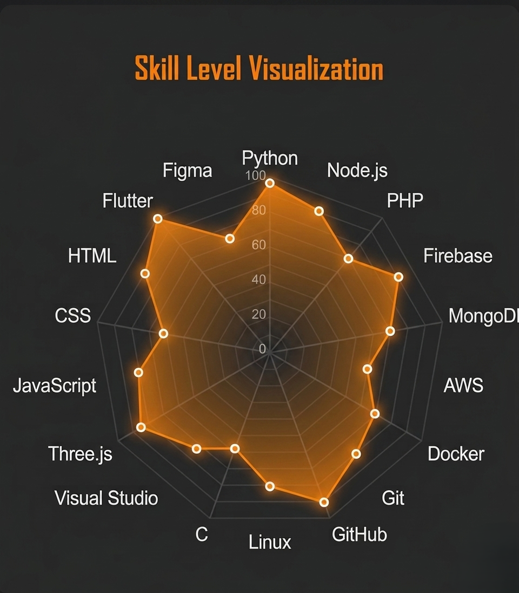

    

# <h1 align="center">Hi 👋, I'm JAYMEEN VAGHELA</h1>
###

<h3 align="center">An aspiring full stack developer and computer engineering student  
    Behind every great product is a backend that keeps pushing upward.</h3>

---
### Current Focus :

- 🔭 Building **[TRINETRA](https://github.com/jaymeen07-r/TRINETRA-public)** — intelligent systems with deep tech vision  
- 🌱 Learning Node.js & scalable backend architectures  
- 💡 Computer Engineering Student | Founder @ TRINETRA  
- 🚀 Passionate about AI, system design & futuristic interfaces

---
### About Me :

I am a **Computer Engineering undergraduate** with a strong passion for backend development and AI-driven system design, focused on building scalable, secure, and intelligent software solutions. I am currently pursuing my Bachelor of Engineering at **Vidush Somany Institute of Technology and Research**, a constituent of **Kadi Sarva Vishwavidyalaya**, Gandhinagar—an institution shaped by over a century of philanthropic excellence in education. This legacy fuels my commitment to innovation, integrity, and purpose-driven computing.

Beyond academics, I am the Founder of **TRINETRA**, an AI-powered misinformation detection Android application built to combat fake, misleading, and manipulated digital content. **TRINETRA** is designed with a clear mission: to enhance digital safety, authenticity, and trust in an era where misinformation spreads faster than truth. By combining AI, data intelligence, and responsible design, I aim to empower users to make informed decisions and contribute to a more transparent digital ecosystem.

I am driven by the belief that technology should not only be powerful, but meaningful—solving real-world problems with precision, empathy, and impact.

---
###  Skills / Tech Stack :

<table>
<tr>
  <td>
    
  </td>
  <td>
    <b>Frontend</b>
    <table>
      <tr><td>HTML5</td><td></td></tr>
      <tr><td>CSS3</td><td></td></tr>
      <tr><td>JavaScript</td><td></td></tr>
      <tr><td>Three Js</td><td></td></tr>
      <tr><td>Figma</td><td></td></tr>
      <tr><td>Flutter</td><td></td></tr>
    </table>
  </td>
  <td>
    <b>Backend</b>
    <table>
      <tr><td>Python</td><td></td></tr>
      <tr><td>Node.js</td><td></td></tr>
      <tr><td>PHP</td><td></td></tr>
      <tr><td>MongoDB</td><td></td></tr>
      <tr><td>Firebase</td><td></td></tr>
      <tr><td>AWS</td><td></td></tr>
    </table>
  </td>
  <td>
    <b>DevOps / Tools</b>
    <table>
      <tr><td>Docker</td><td></td></tr>
      <tr><td>Git</td><td></td></tr>
      <tr><td>GitHub</td><td></td></tr>
      <tr><td>C</td><td></td></tr>
      <tr><td>Linux</td><td></td></tr>
      <tr><td>Visual Studio</td><td></td></tr>
    </table>
  </td>
</tr>
</table>

---

## 🚀 Projects

### 🌟 Featured Projects

- **TRINETRA**  
  AI-powered misinformation detection system focused on digital trust, authenticity, and content verification  
  🔗 https://github.com/jaymeen07-r/TRINETRA-public  

- **APNACHAT**  
  Privacy-first messaging platform built for secure, intelligent, and scalable communication  

- **V.A.S.U.**  
  Advanced virtual assistant with deep system-level integration and automation capabilities  

- **VrudhSeva**  
  Elder care support system focused on accessibility, assistance, and real-world usability  

---

### 🧠 Systems & Research

- **V.I.D.Y.A.** – Deep-learning intelligence system  
- **P.A.R.T.I.C.L.E.** – Modular virtual OS core for intelligent assistants  

---

### ⚙️ Product & Utility Applications

- **MyBite** – Food ordering platform  
- **Classsight Pilot** – Smart school management system for automated workflows  
- **StudentForge** – Student productivity platform  
- **SkyWave Flights** – Flight booking and management system  
- **Desi Kitchen** – QR-based restaurant ordering system  

---

### 🏆 Hackathon Experience

- Gen AI Exchange 2025 – AI-based misinformation tool  
- SIH 2025 – TrueHealth Network (healthcare system)  
- SSIP 2025 – FactWeb AI (information retrieval system)  
- ImpactThon 2025 – Programmable task interface engine  
- Odoo x Gujarat Vidyapith 2026 – Fleet Matrix (fleet management system)  

---

### 📂 All Projects

A complete and organized list of all repositories:

👉 https://github.com/jaymeen07-r/projects-list

---

## 🚀 Impact View

<table>
<tr>
  <!-- PROBLEMS -->
  <td valign="top">
    <h3 align="center">🧩 Problems</h3>
    <table>
      <tr><td>⚠️ Misinformation Spread</td></tr>
      <tr><td>🔓 Lack of Data Privacy</td></tr>
      <tr><td>🧠 Complex System Interaction</td></tr>
      <tr><td>🏫 Inefficient School Management</td></tr>
      <tr><td>🍽️ Unstructured Food Ordering</td></tr>
      <tr><td>👴 Elderly Support Gap</td></tr>
      <tr><td>🎓 Student Productivity Issues</td></tr>
    </table>
  </td>

  <!-- SOLUTIONS -->
  <td valign="top">
    <h3 align="center">⚙️ Solutions</h3>
    <table>
      <tr><td><b>TRINETRA</b> – AI Misinformation Detection</td></tr>
      <tr><td><b>APNACHAT</b> – Privacy-first Messaging</td></tr>
      <tr><td><b>V.A.S.U.</b> – Smart OS Assistant</td></tr>
      <tr><td><b>Classsight Pilot</b> – School Management System</td></tr>
      <tr><td><b>MyBite</b> – Food Ordering Platform</td></tr>
      <tr><td><b>VrudhSeva</b> – Elder Care Support System</td></tr>
      <tr><td><b>StudentForge</b> – Student Productivity Platform</td></tr>
    </table>
  </td>

  <!-- IMPACT -->
  <td valign="top">
    <h3 align="center">🌍 Impact</h3>
    <table>
      <tr><td>✅ Trusted Digital Content</td></tr>
      <tr><td>🔐 Secure Communication</td></tr>
      <tr><td>🤖 Intelligent Automation</td></tr>
      <tr><td>🏫 Smart Education Systems</td></tr>
      <tr><td>⚡ Faster Daily Services</td></tr>
      <tr><td>❤️ Better Elder Support</td></tr>
      <tr><td>📈 Student Growth & Efficiency</td></tr>
    </table>
  </td>
</tr>
</table>

---

## 🤝 Connect with Me

-  Email: jaymeenvaghela07@gmail.com  
-  LinkedIn: https://linkedin.com/in/jaymeen-vaghela-a50649377  
-  Instagram: https://instagram.com/jaymeen07r  
-  GitHub: https://github.com/jaymeen07-r  

---
